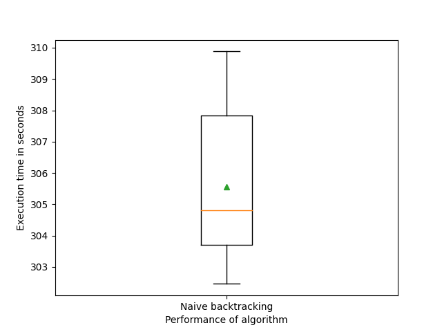
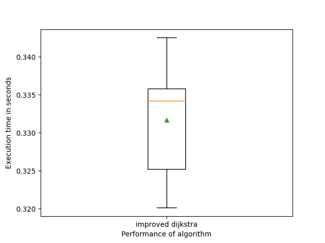
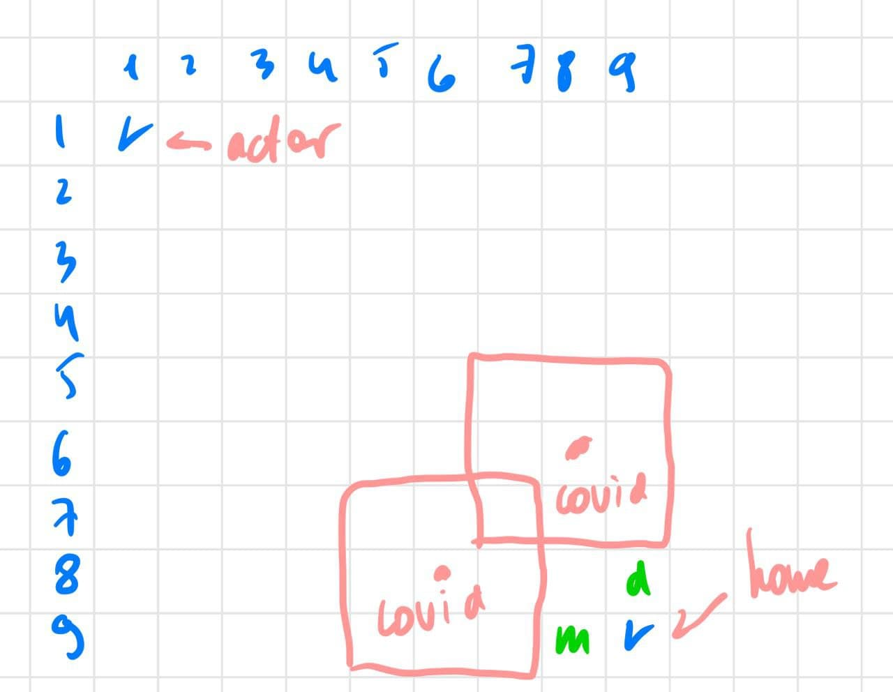
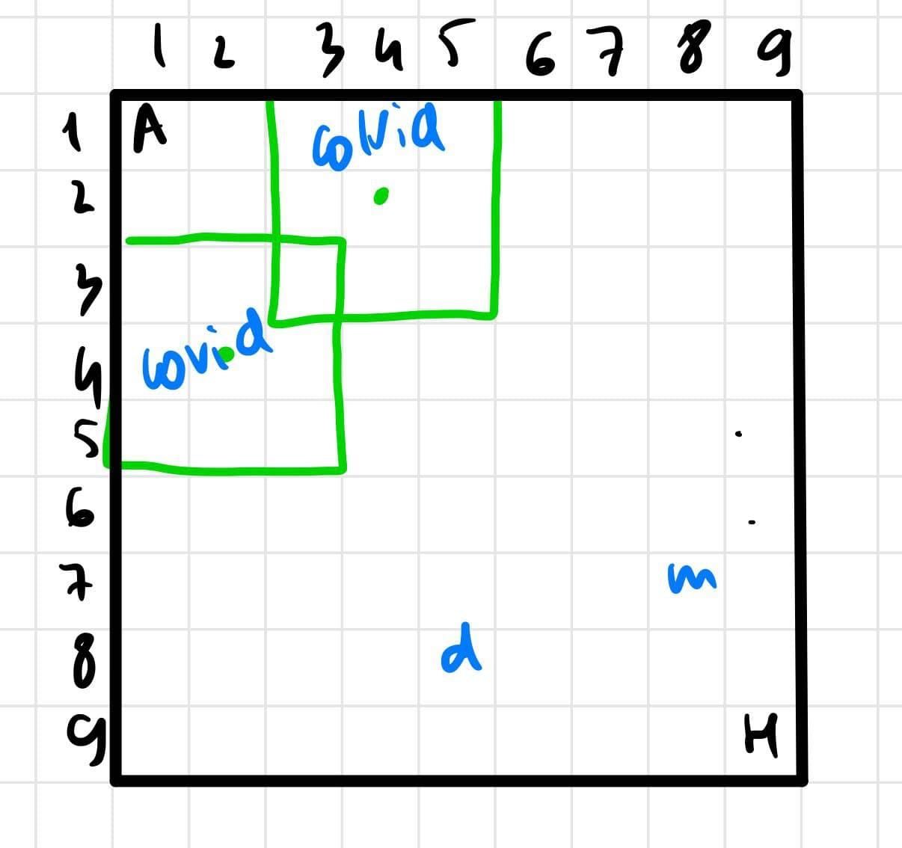

# PrologAssignment
# Tags: Innopolis University, Prolog, AI


Link to source code: 
- ```https://github.com/homomorfism/PrologAssignment``` 
- Please text me to add you to collaborator to see the code.


How to run programs: 
- ```time swipl -s [file].pl -g main -g halt```


Description of using algoritms: 


- backtracking:
	* Description: naive implementation of backtracking algorithm without any heuristics. Slow, not optimised algorithm, that is not recommended to use for traversing graphs. 

	* How backtracking works: from each point it chooses some point in the neighboorhood, adds it into visited path variable and then picks another neighboor and then traverse from it. After finding the neighboor checks that after stepping on that field the actor won't become infected. Also, I store variable Resistance that holds information about picking up mask or become vaccinated. 

	* Handling infected & healing cells: information about resistence of covid is stored in a special variable called Resistance and it's value is updated after each step


	* Pseudocode:
		```
		traverse(From):
			if actor != home: 
				pick a Neighboor of actor,
				make sure that after stepping of this field actor won't become infected,
				if actor picks an mask and visited doctor -> 
					update Resistance variable,
				append Neighboor to visited path variable,
				traverse(Neighboor).
			print: Found path
		```

	* Execution time - extremely long, appr. 7 min on 9 by 9 field.

	* Comments. Due to great difference in execution time 

- dijkstra:

	* Description: this is optimised implementation of backtracting algo. This is fast algorithm, thus is ideally works for finding paths in 2 or 3 D gamefields.

	* How algorithm works: as a global variable (fact) I store a set of all visited paths from initial position to some vertex and min cost, needed to traverse there. 
	As it is known, dijkstra works only on weighted graphs, so I converted gamefield map into weighed graph, where we can traverse from point to its neighboor. At each step we traverse from point to its neighboor, calculate cost to travel there and if cost is less that cost from all visited paths fact, updates value there.

	* Pseudocode:
		```
		traverse(From, CurrentCost):
			if From != Home:
				pick a Neighboor of actor,
				checks that Neighboor is not visited earlier,
				checks that actor won't became abfor stepping on this field
				append to the set of paths tuple (Neighboor, CurrentCost+D),
				if there already exist path containing Neighboor:
					if Cost < CurrentCost + D:
						drop tuple (Neighboor, NeighboorCost)
				traverse(Neighboor, Cost)
			else:
				print: "End of algo!"
		```
	* Execution time: approx. 250ms. for 9 by 9 field.
 	
 	* Comments: this is example of good algorithm that efficiently founds the path from initial position to home. This algo is more preferable rather than by using naive backtracking. 


I tested programs on n=20 examples.

Statictical analysis:
- backtracting
	* range = 1
		* mean = 305.570
		* std = 2.269

- dijkstra:
	* range = 1:
		* mean = 0.269
		* std = 0.007


Box plots:
- backtracking 

{width="300", height="300"}

- dijkstra

{width="300", height="300"}


```
Values: 
	- back(1): 
		* [308.6391164489978, 303.7759414999964, 304.4108637889949, 305.6654304889962, 303.2408647819975, 302.49782397099625, 307.9610317600018, 304.4842530850001, 308.9329794200021, 302.45753051799693, 302.7016417959967, 308.123541124005, 304.69595062200096, 304.87818221300404, 309.8800927150005, 306.7053972420035, 304.7569813009977, 306.24044399800187, 307.8055612780008, 303.5160200340033]

	- dijkstra(1): 
		* [0.3339028269983828, 0.3425407040049322, 0.33449099200515775, 0.33367343500140123, 0.3255993490020046, 0.3357500210040598, 0.32200255100178765, 0.3375343379957485, 0.3275711269961903, 0.3360459589966922, 0.3201877270039404, 0.3324546029980411, 0.320127874998434, 0.335392168002727, 0.322627236993867, 0.3422734620035044, 0.32414685499679763, 0.3351375589991221, 0.3346898469972075, 0.33748612699855585]
```

Calculating p-values: 

- back(1) vs dijkstra(1)
	* p_value = $ 8.52161479432998 * e^{-77} $ <- The most significant p value. 


PEAS model of actor:

- agent type:
	* actor (player)

- perfomance measure: 
	* found minimum path from actor to home

- actuators:
	* making (moves) on the game field
	* abitily to collect a mask or be vaccinated

- environment: 
	* field map with covid, mask and doctor zones

- sensors:
	* information about current position (relative position to the game field boarders)
	* distance to home field
	* information about infected cells when staying close to them

Environment is:

- partially observable
	* actor does not have information about all cells in the map

- deterministic
	* game does not contain any random elements - any change in-game field is fully controlled by the player move

- Single Agent
	* there is no other player, only one agent is playing

- sequential
	*  all moves made by AI algorithms will affect future steps

- discrete
	* there are states in the environment (positions of figures), in this game, there are a finite set of steps, that players can perform

- known
	* there are a complete set of rules of how all figures can move

- static:
	* only the actions of an agent modify game field. There is no other processes are operating on it.


Impossible paths: 
- Map 1 (doc, mask, home is surrounded by covid), tested on both algorithms (execution time on backracting is ~ 12 min.)

{width="300", height="300"}

- Map 2 (actor is surrounded by covid), tested of both algos (execution time < 1s)

{width="300", height="300"}


